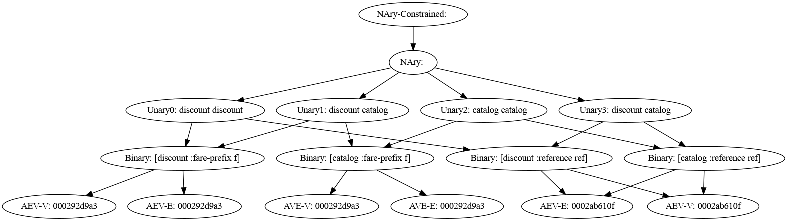

# Crux Inspector

Tool for inspecting Crux Queries. This is a pre-alpha work in
progress, documentation will be added if this tool proves useful.

After runing `lein test` out.clj should be generated

